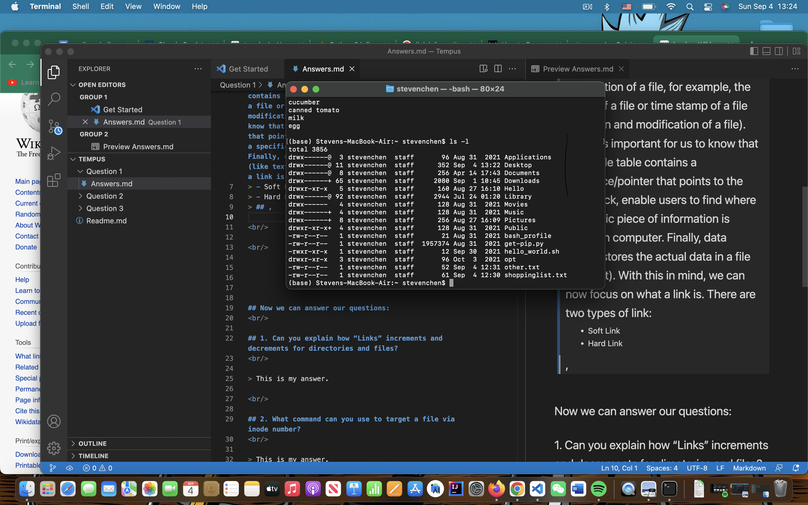

Links in Linux - An introduction
==============
**Author:** *Tianyu Chen*

<br/>
<br/>
 
 In Unix/Linux system, file is a simple structure that contains no metadata. Before we jump into the actual questions, we need to spend some time on learning what __*inode*__ is. According to Wkipidia, inode is a data structure in a Unix-style file system that describes a file-system object such as a file or a directory. Data stored inside inode includes metadata(time of creation/modification, mode, size) and owner of the object etc. To get start with inode, we can think of the hard drive in the computer is mainly consisted by three parts:
 - Super Block
 - Inode Table
 - Data Blocks

, where super block stores information like type of a file system like its status and size; inode table contains information of a file, for example, the mode of a file or time stamp of a file (creation and modification of a file). Also, it's important for us to know that the inode table contains a reference/pointer that points to the datablock, enable users to find where a specific piece of information is stored in computer. Finally, data blocks stores the actual data in a file (like text). Now we use command ```ls -l``` to see some of those information. 

<br/>

<br/>



<br/>

<br/>

 As we can see from the above picture, there are several columns displsyed after the command is executed. Let's pay additional attention on the second column from the left, where __*link*__ of each file is stored. __*link*__ in Unix/Linux file system, like a pointer in programming language like C/C++, is a reference between/among files. There are two types of links:
 - Soft Link
 - Hard Link

To tell the difference between hard links and soft (or symbolic) links, we need come down to what they reference. Hard links point to a specific space on the hard drive, in other words, hard links point to the inode number of a file. As for soft links, they still point to an inode number, but if you create a second file, this second file does not point to the hard drive, but instead, to the first file. Another way to understand this is: both hard links and files point to inode number while softlinks point to files only. Therefore, changes in number of hard links will influence the total number of links in an inode while changes in number of soft links does not. Let's see an example:
<br/>

<br/>


<br/>

<br/>
Here, we created a soft link named "Costco" that points to file "shoppinglist.txt". As we can see, there is 1 link presented. Now, if we remove the file "shoppinglist.txt"(change its name to "newlist.txt")
<br/>

<br/>

 

<br/>

<br/>

We found that the total number of link of file "newlist.txt" remains after we "remove" the link "Costco". Another great example to understand how soft links work the shortcut of a program/software on your desktop, it can be regarded as a soft link points to the file containing the real program.

 Next, let's take look at hard links. In the following picture, we can see that there's only one link exists in the file "other.txt". 

<br/>

<br/>


<br/>

<br/>

 Suppose that if we can only find items in "other.txt" in Target, then we have to go there and grab them. So we use command ```ln targetFile sourceFile``` to create a hard link for "other.txt". 

<br/>

<br/>


<br/>

<br/>

 By above picture, we found that the number of links of "other.txt" incremented by one. Now, let's see both of "other.txt" and "target"

<br/>

<br/>


<br/>

<br/>

, we can see that both files share the same inode number in the system. Now we can try change the name of "other.txt"
<br/>

<br/>


<br/>

<br/>

 There are still 2 links presented in the inode number of ```31276082```, that because "Target" points to the target of ```31276082``` rather than the name of the file. Similarly, if we remove "Target" from the directory, the number of links will decremented by 1 like the following picture show. 
<br/>

<br/>


<br/>

<br/>

## With all these things in mind, now we can answer our questions:

<br/>

<br/>

<br/>
## 1. Can you explain how “Links” increments and decrements for directories and files?
<br/>

> By the above description, we know that number of links of a source file behave differently depends on the what type of link is "increment" or "decrement". If the link added/removed is a soft link/symbolic link, then number of links remains at value of 1. If it's a hard link, then each time a new link is created, this value is increased by 1. When a link is removed, the value is decreased by 1.

<br/>

## 2. What command can you use to target a file via inode number?
<br/>

> By now, we know that each file has its own inode number. Therefore, we can use ```find``` command with argument as ```inum```, which is short for inode number. For example, if we have an file with inode number of 11111, we can find it via command ```find -inum 11111```. 

<!--
insert a picture here
-->

<br/>


## 3. What are the Links in an empty directory?
<br/>

> Every directory has a link to itself and its parent. Therefore, for an empty directory, there are 2 links in it. 

<br/>

## 4. How do stat links relate to the ln function?

<br/>

> By default, ```ln``` command creates hard links and terminal will display number of hard links of a file/directory after executing ``` stat ``` command. Therefore, if use ``` ln ``` command to create a new hard link, then number of links displayed on ``` stat ``` will increase by 1. 
<br/>
## 5. Finally, during the self-research, I used the following commands:
<!--
Hello
-->

- ``` ls ```
- ``` cd ```
- ``` mv ```
- ``` mkdir ```
- ``` pwd ```
- ``` ln ```
- ``` find -inum```
- ``` stat ```
- ``` rm ```
- ``` touch ```
- ``` cat ```