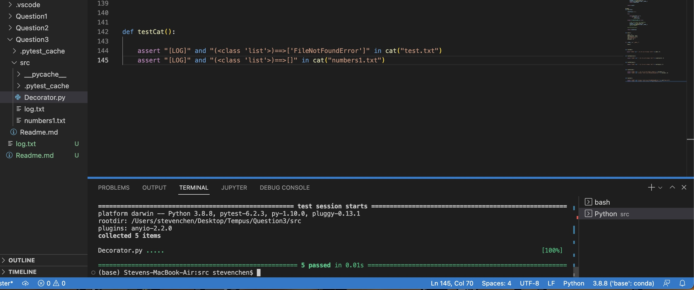

Overview
==============

Logging is very important in software development. Things like tracking events, debugging are performed using Logging. Normally, language like Python and Java comes with a library/module that implements a logging system, which make programmers life much easier. 

In this program, I designed a logging decorator without using ```logging``` module of Python. This decorator can be used to decorate fucnctions involving mathematic computing which logs some message. In addition to the output information required in the problem statement, I added time of executions of functions to the log messages in order to help debug. The format of the logging message is like the following:

-  ```[LOG] - <function address> - time - (input value) ==> return value/Return Type&Errors if any```

To verify the program works, I setup a test that checks the contain of the string. Since the time of execution of the program and address varies, the test will check whether the returned message contains the following string:
- ```[LOG]```
- ```(input value) ==> return value/Return Type&Errors ```


The test result is shown in the following picture:


